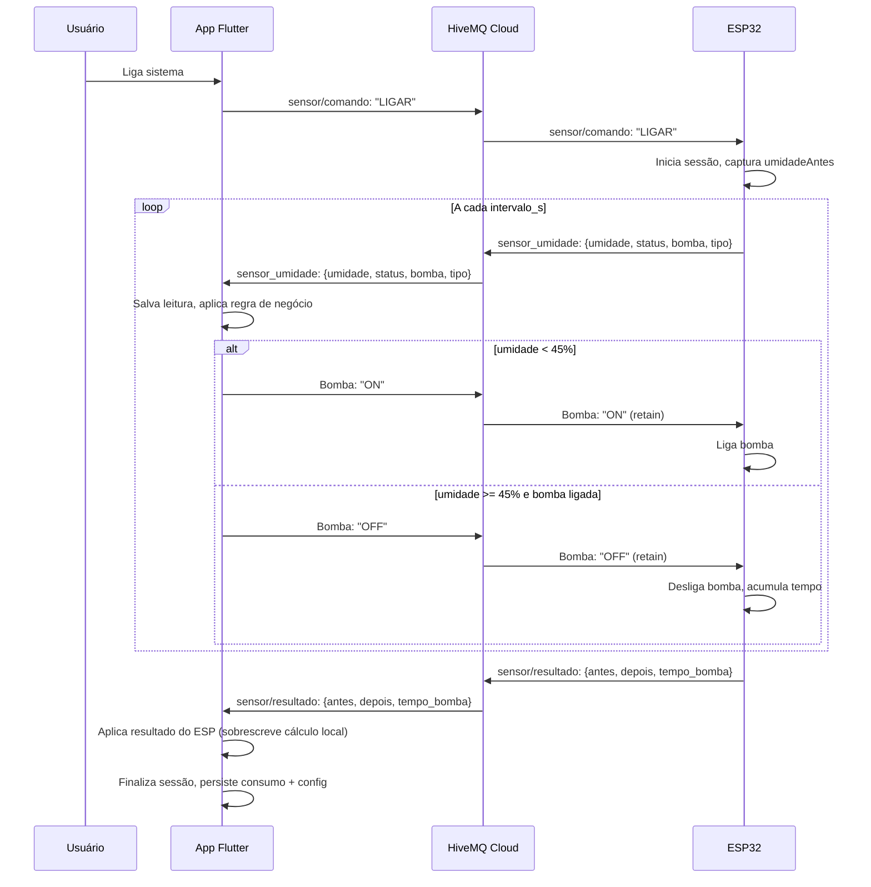

# Esquemas do Projeto — Controle de Irrigação

## 1. Diagrama de Casos de Uso

```mermaid
graph TD
    subgraph Autenticação
        UC01[Criar conta]
        UC02[Fazer login]
        UC03[Fazer logout]
    end

    subgraph Sistema
        UC04[Ligar sistema]
        UC05[Desligar sistema]
        UC06[Ver status do sistema]
    end

    subgraph Leitura
        UC07[Leitura automática<br/>(sessão ESP)]
        UC08[Leitura manual<br/>(rápida)]
        UC09[Ver histórico de leituras]
    end

    subgraph Bomba
        UC10[Ligar bomba manualmente]
        UC11[Desligar bomba manualmente]
        UC12[Bomba liga automática<br/>(solo seco)]
    end

    subgraph Configuração
        UC13[Configurar intervalo]
        UC14[Configurar potência]
        UC15[Configurar diâmetro]
    end

    subgraph Monitoramento
        UC16[Ver consumo de água]
        UC17[Ver status conexão<br/>MQTT / ESP32]
    end

    subgraph Sessão
        UC18[Sessão automática]
        UC19[Finalização por timeout]
        UC20[Ver resultado da sessão]
    end
```

## 2. Descrição dos Casos de Uso

### Autenticação

| ID | Nome | Ator | Descrição | Pré-condição | Pós-condição |
|----|------|------|-----------|-------------|-------------|
| UC01 | Criar conta | Usuário | Cadastra email + senha via SharedPreferences | — | Conta criada, redirecionado para Home |
| UC02 | Fazer login | Usuário | Informa email + senha cadastrados | Conta existente | Sessão iniciada, redirecionado para Home |
| UC03 | Fazer logout | Usuário | Encerra sessão | Estar autenticado | Retorna para tela de login |

### Sistema

| ID | Nome | Ator | Descrição | Pré-condição | Pós-condição |
|----|------|------|-----------|-------------|-------------|
| UC04 | Ligar sistema | Usuário | Publica `LIGAR` no tópico `sensor/comando` | Config válida | ESP inicia sessão |
| UC05 | Desligar sistema | Usuário | Publica `DESLIGAR` no tópico `sensor/comando` | Sistema ligado | Sessão finalizada (resultados salvos), ESP encerra |
| UC06 | Ver status | Usuário | Visualiza MQTT, ESP32 e bomba | — | — |

### Leitura do Solo

| ID | Nome | Ator | Descrição | Pré-condição | Pós-condição |
|----|------|------|-----------|-------------|-------------|
| UC07 | Leitura automática | ESP32 | Durante sessão, publica a cada `intervalo_s` | Sessão ativa | Leitura salva no BD e exibida |
| UC08 | Leitura manual | Usuário | Publica `LER` no `sensor/comando` | Cooldown respeitado | Leitura salva no BD e exibida |
| UC09 | Ver histórico | Usuário | Lista leituras ordenadas por data | — | — |

### Bomba

| ID | Nome | Ator | Descrição | Pré-condição | Pós-condição |
|----|------|------|-----------|-------------|-------------|
| UC10 | Ligar bomba | Usuário | Publica `ON` no tópico `Bomba` | Sessão ativa | Bomba ligada, `bombaDesligadaManual = false` |
| UC11 | Desligar bomba manual | Usuário | Publica `OFF` no tópico `Bomba` | — | Bomba + sistema desligados, `bombaDesligadaManual = true` |
| UC12 | Bomba automática | App/ESP | App liga se umidade < 45%; ESP desliga se ≥ 45% | Sessão ativa | Bomba controlada pelo firmware |

### Configuração

| ID | Nome | Ator | Descrição |
|----|------|------|-----------|
| UC13 | Configurar intervalo | Usuário | Altera `intervaloLeitura`; se MQTT conectado, publica `{"intervalo_s": N}` |
| UC14 | Configurar potência | Usuário | Altera `potenciaBomba` |
| UC15 | Configurar diâmetro | Usuário | Altera `diametroTubulacao` |

### Monitoramento

| ID | Nome | Ator | Descrição |
|----|------|------|-----------|
| UC16 | Ver consumo | Usuário | Exibe consumo do último ciclo, hoje, mês e ano |
| UC17 | Ver status conexão | Usuário | Indicadores verde/vermelho para MQTT e ESP32 |

### Sessão

| ID | Nome | Ator | Descrição |
|----|------|------|-----------|
| UC18 | Sessão automática | ESP32 | Duração máxima configurável; cooldown 10s entre leituras |
| UC19 | Finalização por timeout | App | `intervaloLeitura + 2 min` sem leitura → sessão encerrada |
| UC20 | Ver resultado | Usuário | Exibe `antes`, `depois`, `tempo_bomba` e `consumo` do último ciclo |

---

## 3. Schema do Banco de Dados (SQLite)

### Tabela: `leituras`

Armazena o histórico de leituras de umidade do solo.

```sql
CREATE TABLE leituras (
    id             INTEGER PRIMARY KEY AUTOINCREMENT,
    data           TEXT    NOT NULL,  -- ISO 8601 (ex: "2026-06-10T21:30:00.000")
    umidade        INTEGER NOT NULL,  -- 0 a 100 (%)
    status_solo    TEXT    NOT NULL,  -- "Muito seco" | "Seco" | "Ideal" | "Úmido" | "Encharcado"
    tipo           TEXT    NOT NULL,  -- "manual" | "automática"
    usuario_email  TEXT    NOT NULL DEFAULT ''
);
```

### Tabela: `consumo`

Registra o consumo de água por ciclo de irrigação.

```sql
CREATE TABLE consumo (
    id              INTEGER PRIMARY KEY AUTOINCREMENT,
    data            TEXT    NOT NULL,  -- ISO 8601
    litros          REAL    NOT NULL,  -- Ex: 12.5
    tempo_segundos  INTEGER NOT NULL,  -- Tempo que a bomba ficou ligada
    usuario_email   TEXT    NOT NULL DEFAULT ''
);
```

### Tabela: `config`

Armazena configurações do sistema por usuário (chave-valor).

```sql
CREATE TABLE config (
    chave           TEXT NOT NULL,
    valor           TEXT NOT NULL,
    usuario_email   TEXT NOT NULL DEFAULT '',
    PRIMARY KEY (chave, usuario_email)
);
```

Chaves utilizadas:
- `intervalo_leitura` — inteiro (minutos ou horas)
- `unidade_intervalo` — `"min"` ou `"h"`
- `potencia_bomba` — double (watts)
- `diametro_tubulacao` — double (mm)
- `sessao_antes` — umidade antes da bomba ligar (%)
- `sessao_depois` — umidade depois da bomba desligar (%)
- `sessao_tempo` — tempo total da bomba ligada (segundos)
- `sessao_consumo` — consumo calculado do último ciclo (litros)

### Tabela: `usuarios`

```sql
CREATE TABLE usuarios (
    email       TEXT PRIMARY KEY,
    senha_hash  TEXT NOT NULL,
    salt        TEXT NOT NULL,
    criado_em   TEXT NOT NULL
);
```

### Migrações

| Versão | Mudança |
|--------|---------|
| v1 (inicial) | `leituras` |
| v1→v2 | Adiciona `consumo` e `config` |
| v2→v3 | Adiciona `usuario_email` em `leituras`, `consumo`; recria `config` com PK composta |
| v3→v4 | Adiciona tabela `usuarios` |

---

## 4. Fluxo de Dados — Sessão de Irrigação



---

## 5. Mapa de Telas × Casos de Uso

| Tela | Casos de Uso |
|------|-------------|
| **AuthScreen** | UC01, UC02 |
| **HomeScreen** | UC03 (logout na AppBar) |
| **MetricsScreen** | UC04, UC05, UC06, UC08, UC16, UC17 |
| **SensorScreen** | UC06, UC07, UC17, UC18, UC19, UC20 |
| **PumpScreen** | UC10, UC11, UC12, UC16 |
| **ConfigScreen** | UC13, UC14, UC15 |
| **ReadingsScreen** | UC09 |

---

## 6. MQTT — Tópicos e Payloads

| Tópico | Direção | QoS | Retain | Payload | Descrição |
|--------|---------|-----|--------|---------|-----------|
| `sensor_umidade` | ESP → App | 0 | não | `{"umidade": N, "status": "...", "bomba": "ON/OFF", "tipo": "auto/manual"}` | Leitura do sensor |
| `Bomba` | App ↔ ESP | 1 | sim | `"ON"` / `"OFF"` | Estado da bomba |
| `sensor/comando` | App → ESP | 0 | não | `"LIGAR"` / `"DESLIGAR"` / `"LER"` | Comandos para o ESP |
| `esp32/status` | ESP → App (LWT) | 1 | não | `"online"` / `"offline"` | Status de conexão do ESP |
| `sensor/resultado` | ESP → App | 0 | não | `{"antes": N, "depois": N, "tempo_bomba": N}` | Resultado da sessão |
| `sensor/config` | App → ESP | 0 | não | `{"intervalo_s": N}` | Configura intervalo |

---

## 7. Firmware ESP32 (`iot_code.ino`)

### Tópicos assinados pelo ESP

| Tópico | Ação ao receber |
|--------|----------------|
| `Bomba` | `"ON"` → desbloqueia e liga bomba; `"OFF"` → bloqueia bomba e encerra sessão |
| `sensor/comando` | `"LIGAR"` → inicia sessão; `"DESLIGAR"` → encerra sessão; `"LER"` → leitura manual (cooldown 10s) |
| `sensor/config` | Atualiza `intervaloLeituraMs` se `>= 10s` |

### Tópicos publicados pelo ESP

| Tópico | Quando | Payload |
|--------|--------|---------|
| `sensor_umidade` | A cada `intervaloLeituraMs` durante sessão, ou em leitura manual | `{"umidade": N, "status": "...", "bomba": "ON/OFF", "tipo": "auto/manual"}` |
| `Bomba` (retain) | Ao ligar/desligar a bomba | `"ON"` / `"OFF"` |
| `esp32/status` (LWT + online) | Conexão/disconexão MQTT | `"online"` / `"offline"` |
| `sensor/resultado` | Ao finalizar sessão | `{"antes": N, "depois": N, "tempo_bomba": N}` |

### Funções principais

| Função | O que é |
|--------|---------|
| `setup()` | Inicialização: Serial, pinos, Wi-Fi, MQTT (callback assinatura de tópicos) |
| `loop()` | Loop principal: reconexão Wi-Fi/MQTT, timer de sessão, leitura e controle da bomba |
| `conectarWiFi()` | Conexão Wi‑Fi com até 20s de tentativa; reinicia o ESP se falhar |
| `conectarMQTT()` | Conexão MQTT com HiveMQ Cloud; publica `online` no LWT e re-sincroniza estado da bomba |
| `callbackMQTT()` | Callback de mensagens recebidas: roteia para comando, bomba ou config |
| `lerUmidade()` | Leitura do sensor analógico (média de 10 amostras), mapeada para 0–100% |
| `publicarLeitura()` | Monta JSON e publica no tópico sensor_umidade |
| `ligarBomba()` | Liga o relé da bomba, inicia contagem de tempo, publica `"ON"` |
| `desligarBomba()` | Desliga o relé, acumula tempo no `tempoBombaMs`, publica `"OFF"` |
| `finalizarSessao()` | Desliga bomba, publica `sensor/resultado` com `antes`/`depois`/`tempo_bomba` |
| `statusSolo()` | Classifica umidade em "muito_seco", "seco", "ideal", "umido", "encharcado" |

### Regra de negócio do firmware

```
Loop da sessão (a cada intervaloLeituraMs):
  1. Ler umidade do sensor
  2. Se for a primeira leitura, salvar como umidadeAntes
  3. Publicar leitura no tópico sensor_umidade
  4. Se umidade < 45%: ligar bomba
  5. Se umidade >= 45%:
     - Se bomba estava ligada (ou já acumulou tempo): finalizar sessão com a leitura atual
     - Senão: apenas garantir bomba desligada
  6. Se tempo de sessão >= 2 min: finalizar sessão (timeout)
```

---

## 8. Principais Funções do Código (App)

### `system_provider.dart`

| Método | O que é |
|--------|---------|
| `inicarSessao(email)` | Inicialização da sessão do usuário (carga de dados do BD) |
| `_carregarLeituras()` | Carga de leituras do banco |
| `_carregarConsumos()` | Carga de consumo do banco |
| `_carregarConfig()` | Carga de configurações do banco |
| `_timerSessao()` | Timer periódico de verificação de timeout |
| `_setupMqttCallbacks()` | Registro dos callbacks de mensagens MQTT |
| `_aplicarRegraDeNegocio(umidade)` | Regra de negócio: liga/desliga bomba conforme umidade |
| `_acumularConsumo()` | Acumulador de tempo e consumo da bomba |
| `_finalizarSessao()` | Finalização da sessão (persiste resultados, reseta estado) |
| `_salvarResultadoSessao()` | Persistência dos resultados no banco (config) |
| `_adicionarLeitura()` | Inserção de leitura na lista e no banco |
| `_calcularStatus(umidade)` | Classificação do solo por faixa de umidade |
| `conectarMqtt()` | Conexão MQTT com 3 tentativas |
| `realizarLeituraRapida()` | Leitura manual (mock se offline, LER se online) |
| `toggleSistema()` | Alterna liga/desliga do sistema |
| `desligarSistema()` | Desligamento forçado do sistema |
| `_ligarBombaInterno(umidade)` | Acionamento automático da bomba (regra de negócio) |
| `ligarBomba()` | Acionamento manual da bomba pelo usuário |
| `desligarBombaManual()` | Desligamento manual da bomba |
| `setIntervalo()` | Configuração do intervalo de leitura |
| `setUnidadeIntervalo()` | Configuração da unidade de intervalo |
| `setPotenciaBomba()` | Configuração da potência da bomba |
| `setDiametroTubulacao()` | Configuração do diâmetro da tubulação |

### `mqtt_service.dart`

| Método/Callback | O que é |
|-----------------|---------|
| `connect()` | Conexão ao broker HiveMQ Cloud (TLS ou WebSocket) |
| `sendComando()` | Publicação no tópico sensor/comando |
| `setBomba()` | Publicação do estado da bomba (com retain) |
| `setConfig()` | Publicação de configuração de intervalo |
| `disconnect()` | Desconexão do broker |
| `onLeituraSensor` | Callback de leitura do sensor |
| `onResultadoSessao` | Callback de resultado da sessão |
| `onStatusBomba` | Callback de estado da bomba |
| `onConexaoEsp` | Callback de status de conexão do ESP |
| `onConexaoMqtt` | Callback de status de conexão MQTT |

### `database_service.dart`

| Método | O que é |
|--------|---------|
| `database` | Instância singleton do SQLite |
| `salvarLeitura()` | Persistência de leitura |
| `carregarLeituras()` | Carga de leituras (ordenado por data DESC) |
| `salvarConsumo()` | Persistência de consumo |
| `carregarConsumos()` | Carga de consumos |
| `salvarConfig()` | Persistência de configuração (upsert) |
| `carregarConfigs()` | Carga de configurações |
| `usuarioTemDados()` | Verificação de existência de dados do usuário |
| `sembrarDadosMock()` | Seed de dados mockados para novo usuário |
| `gerarSalt()` | Geração de salt criptográfico (16 bytes) |
| `hashSenha()` | Hash SHA-256 com salt |
| `verificarSenha()` | Verificação de senha contra hash |
| `criarUsuario()` | Persistência de usuário no SQLite |
| `carregarUsuario()` | Carga de usuário do SQLite |

### `auth_service.dart`

| Método | O que é |
|--------|---------|
| `init()` | Inicialização: carga de contas e sessão persistida |
| `register()` | Registro de nova conta (email + senha com hash) |
| `login()` | Autenticação (LGPD: erro genérico) |
| `logout()` | Encerramento de sessão |
